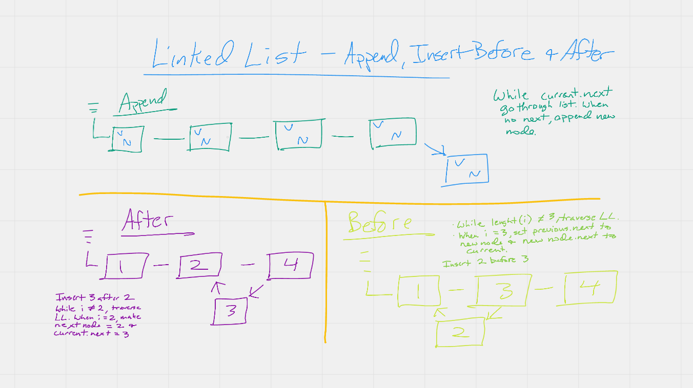

# Singly Linked List
Build a linked list from modularized components using Node.js.

## Challenge

- Define a method called insert which takes any value as an argument and adds a new node with that value to the head of the list with an O(1) Time performance.
- Define a method called includes which takes any value as an argument and returns a boolean result depending on whether that value exists as a Node’s value somewhere within the list.
- Define a method called toString (or __str__ in Python) which takes in no arguments and returns a string representing all the values in the Linked List, formatted as:
`"{ a } -> { b } -> { c } -> NULL"`

## Approach & Efficiency

- My approach was to begin by understanding the requirements. Then I started to think about how I would actually achieve the requirements. I used some drawing in my notebook and sketched out the flow. Once I felt like that was solid, I began coding. I built in-line tests into my code before I built actual tests. I used the internet to search for topics when I was stuck.
- My Big O for this project is either O(1) or O(n).

## API

insert - create a new node.
append - add a node at the head.
includes - search the LL to see if it includes a value.
getByIndex - search the LL and return the index of the value.
insertBefore - insert a new node before a specified value
insertAfter - insert a new node after a specified value
toString - create a string from all the node values

## Tests

1. Can successfully instantiate an empty linked list
1. Can properly insert into the linked list
1. The head property will properly point to the first node in the linked list
1. Can properly insert multiple nodes into the linked list
1. Will return true when finding a value within the linked list that exists
1. Will return false when searching for a value in the linked list that does not exist
1. Can properly return a collection of all the values that exist in the linked list

- Append, Insert Before and After
