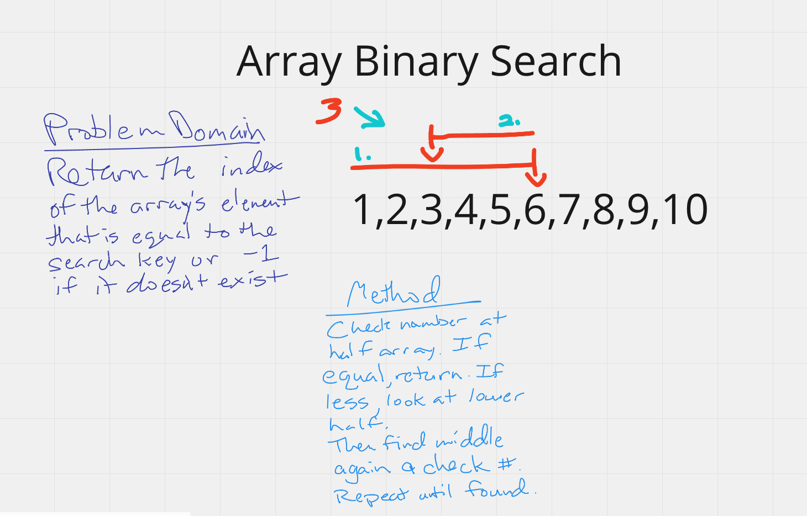

# Challenge Summary
Binary search in a sorted 1D array
## Challenge Description
Write a function called BinarySearch which takes in 2 parameters: a sorted array and the search key. Without utilizing any of the built-in methods available to your language, return the index of the array’s element that is equal to the search key, or -1 if the element does not exist.

## Approach & Efficiency
First find middle index(mid) of array(arr) and compare number(num). If match, return index. If less than mid, reset max to mid and reset mid to new mid, then compare to num. Repeat until match found or if no match found, return -1.

## Solution
