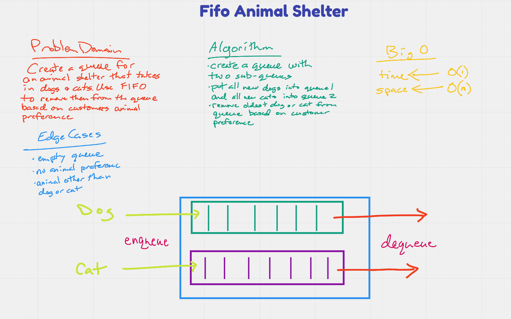

# fifo animal shelter

Build a queue for an animla shelter that takes in dogs and cats and uses a FIFO approach

## Challenge

1. enqueue(animal): adds animal to the shelter. animal can be either a dog or a cat object.
1. dequeue(pref): returns either a dog or a cat. If pref is not "dog" or "cat" then return null.

## Approach & Efficiency

- My approach was to begin by mapping out the parnet queue with two sub-queue's, one each for dogs and cats. Then I tried to visualize the code that ould be needed to determine which animal goes into each queue.

## API

newAnimal - adds an animal, either a dog or a cat
dequeueDog - adopts and removes a dog from the shelter
dequeueCat - adopts and removes a cat from the shelter
printDog - will print a list of all dogs currently in the shelter
printCat - will print a list of all cats currently in the shelter

## Tests

1. Can successfully instantiate an empty queue
1. Can properly insert a dog into the queue
1. Can properly insert a cat into the queue
1. Can properly insert multiple dogs and cats into the queue
1. Can properly remove a dog from the queue
1. Can properly remove a cat from the queue
1. Return null if a differnt animal is added
1. Returns an error if trying to remove an animal from an empty queue

---

