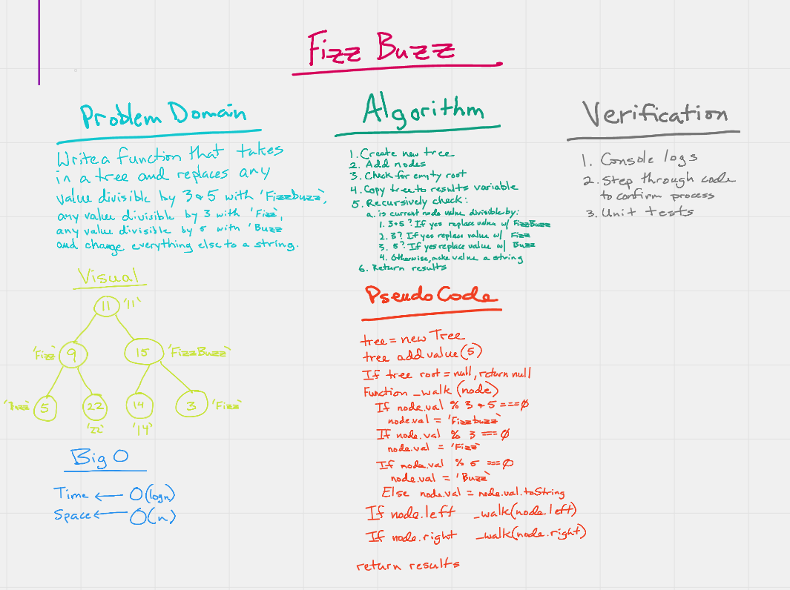

# Fizz Buzz FizzBuzz

> Write a function called FizzBuzzTree which takes a k-ary tree as an argument.

## Challenge Description

> Without utilizing any of the built-in methods available to your language, determine whether or not the value of each node is divisible by 3, 5 or both. Create a new tree with the same structure as the original, but the values modified as follows:

1. If the value is divisible by 3, replace the value with “Fizz”
1. If the value is divisible by 5, replace the value with “Buzz”
1. If the value is divisible by 3 and 5, replace the value with “FizzBuzz”
1. If the value is not divisible by 3 or 5, simply turn the number into a String.

## Approach & Efficiency

> I apprached this by utilizing the preOrder method we wrote for binary search trees. I first verified that the tree is not empty. Then I pushed the tree into a new variable. I checked each value to divisible by 3 and 5, 3 and then 5, modifying the value of it matches any. If not, then I changed the value to a string.

> Big O of Time is O(log(n))

> Big O of Space is O(n)

## Solution

