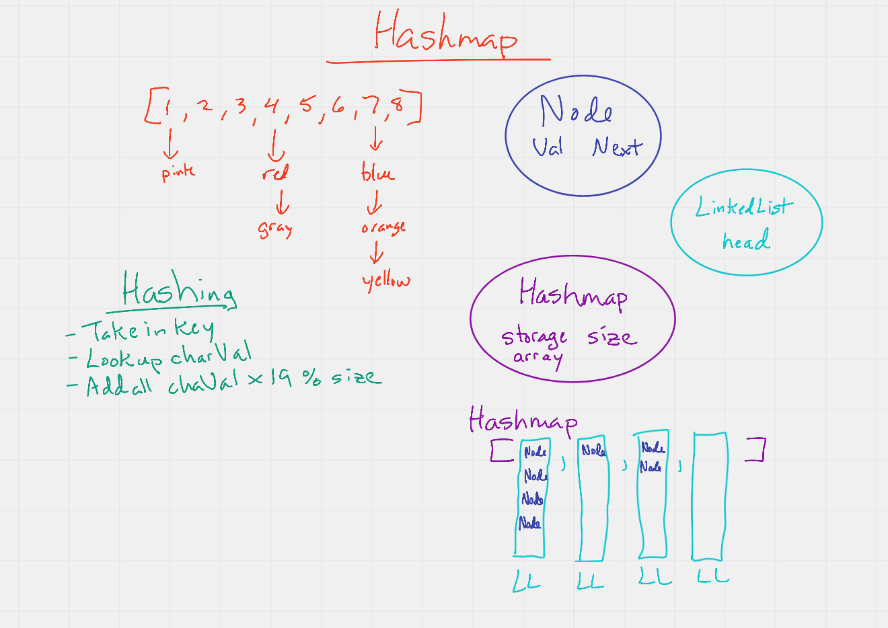

# Hashmaps

> Implement a Hashmap algorithm without using built-in JavaScript methods

## Features

1. `add`: takes in both the key and value. This method should hash the key, and add the key and value pair to the table, handling collisions as needed.
1. `get`: takes in the key and returns the value from the table.
1. `contains`: takes in the key and returns a boolean, indicating if the key exists in the table already.
1. `hash`: takes in an arbitrary key and returns an index in the collection.

## Approach

- I used a common structure for build Hashtables that require a Node, a Linked List and a Hashing function. Then I built methods that add a node to the table, hash the node to the correct index, check if a node exists in the table and returns errors when the node does not exist.

## Testing

1. Adding a key/value to your hashtable results in the value being in the data structure
1. Retrieving based on a key returns the value stored
1. Successfully returns null for a key that does not exist in the hashtable
1. Successfully handle a collision within the hashtable
1. Successfully retrieve a value from a bucket within the hashtable that has a collision
1. Successfully hash a key to an in-range value

## UML

;
