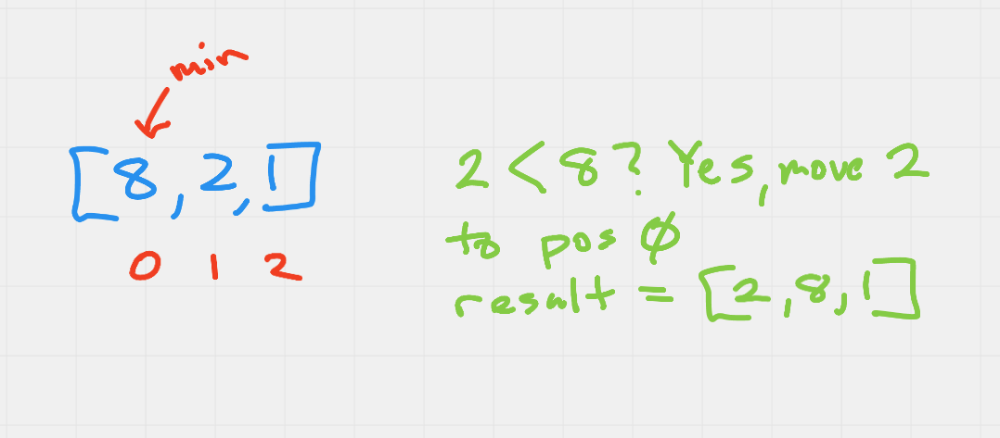
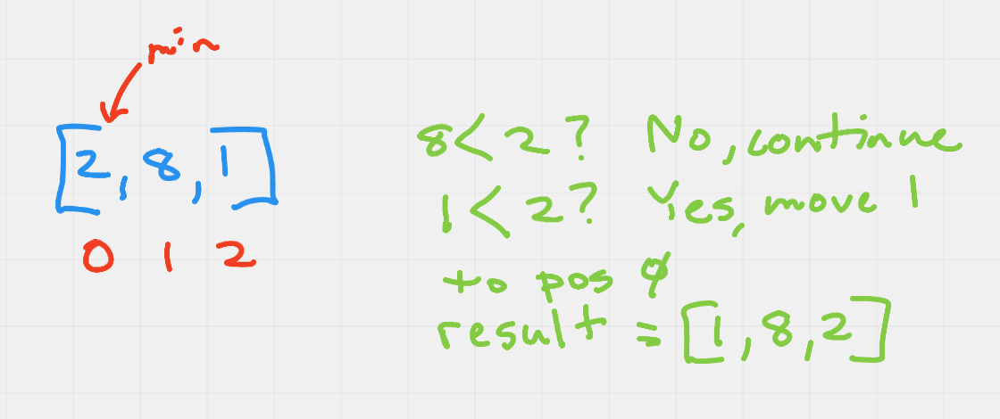
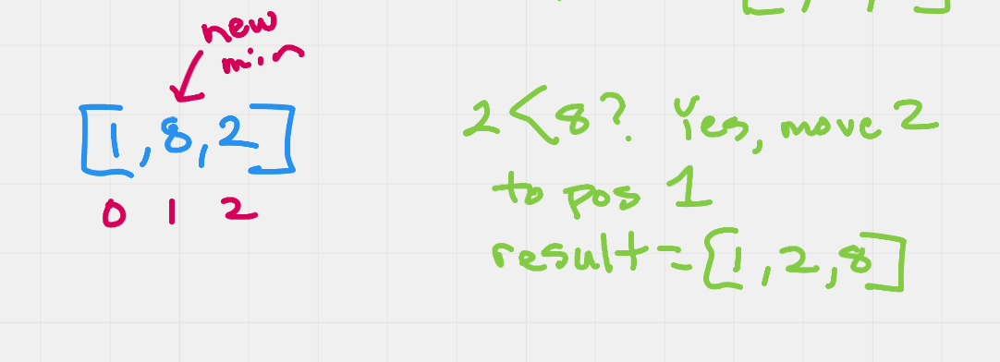
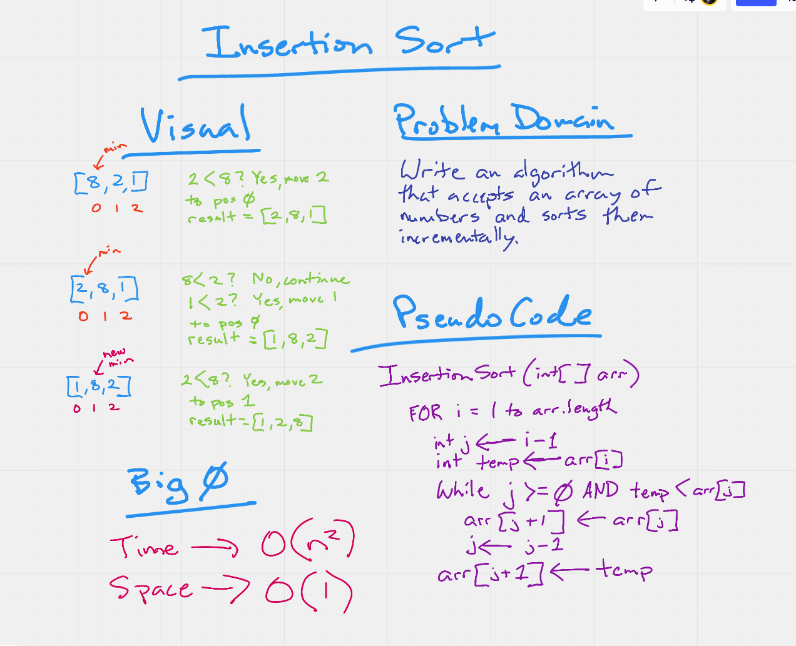

# Array Insertion Sort

> Insertion Sort is a sorting algorithm that traverses an array and sorts the values. The algorithm keeps track of the minimum value and places it in the fron tof the array whcih will be sorted incrementally.

## Link to Code

You can find the code here...
[https://github.com/daneng1/data-structures-and-algorithms/tree/main/challenges/insertion-sort](https://github.com/daneng1/data-structures-and-algorithms/tree/main/challenges/insertion-sort).

## Pseudo Code

```
InsertionSort(int[] arr)
  
    FOR i = 1 to arr.length
    
      int j <-- i - 1
      int temp <-- arr[i]
      
      WHILE j >= 0 AND temp < arr[j]
        arr[j + 1] <-- arr[j]
        j <-- j - 1
        
      arr[j + 1] <-- temp
```

## Trace

Sample Array: `[8,2,1]`

*Pass 1:*

On the first pass, 8 is set as the minimum value. it is then compared to 2, which is smaller and so they are swapped in the array.



Next, 2 is compared to 1 which is smaller and they are also swapped in the array, resulting in [1,8,2] and the smallest value is now in the first postion of the array.



*Pass 2:*

On the second pass we start with the second number. It is compared to the next number which is smaller and they are swapped in the array resulting in [1,2,8] which is now incrementally sorted.



### Whiteboard Diagram



### Efficiency

Time - since this requires a nested loop, the big O(n^2).

Space - no additional space is needed and the space is 0(1).
