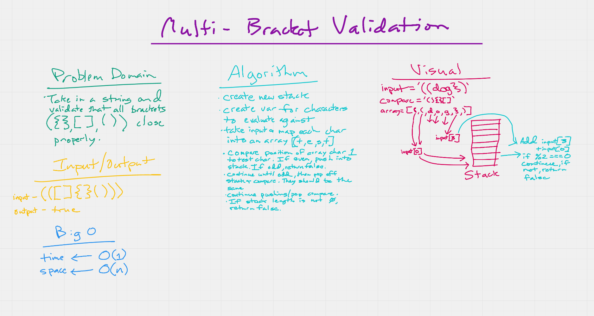

# Multi-bracket Validation

> Your function should take a string as its only argument, and should return a boolean representing whether or not the brackets in the string are balanced. There are 3 types of brackets:

1. Round Brackets : ()
1. Square Brackets : []
1. Curly Brackets : {}

## Challenge Description

> Write a function called multi-bracket-validation that takes in a string and validates if the brackets are properly closed. If the string does have properly closed brackets, return true, if not, return false.

## Approach & Efficiency

> Map over string to comma-seperate each character into an array, compare each array value to test values and positions returned. If not, return false.

## Solution

