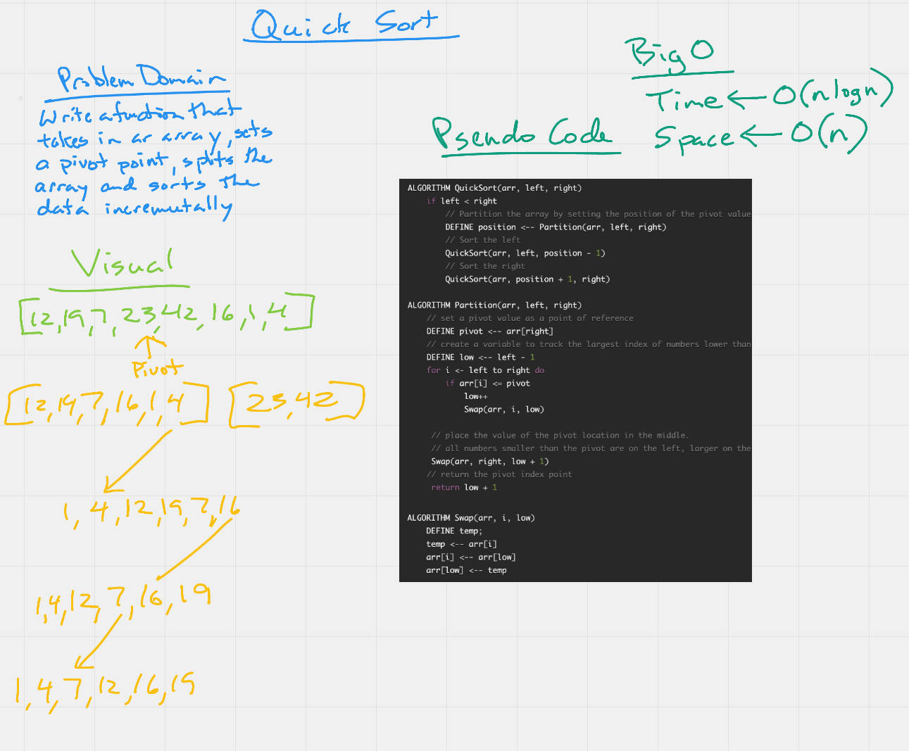

# Quick Sort

## Link to Code

You can find the code here...
[https://github.com/daneng1/data-structures-and-algorithms/tree/main/challenges/insertion-sort](https://github.com/daneng1/data-structures-and-algorithms/tree/main/challenges/insertion-sort).

## Whiteboard

### Efficiency

Time - since this requires a nested loop, the big O(n log n).

Space - no additional space is needed and the space is 0(n).