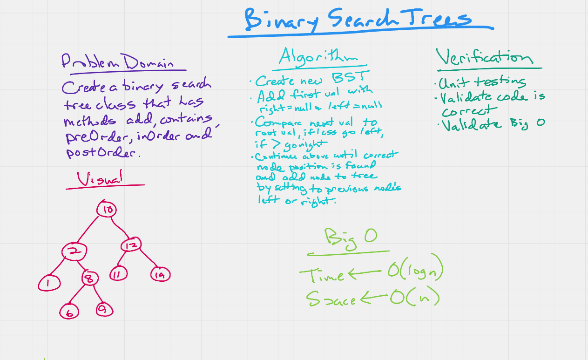
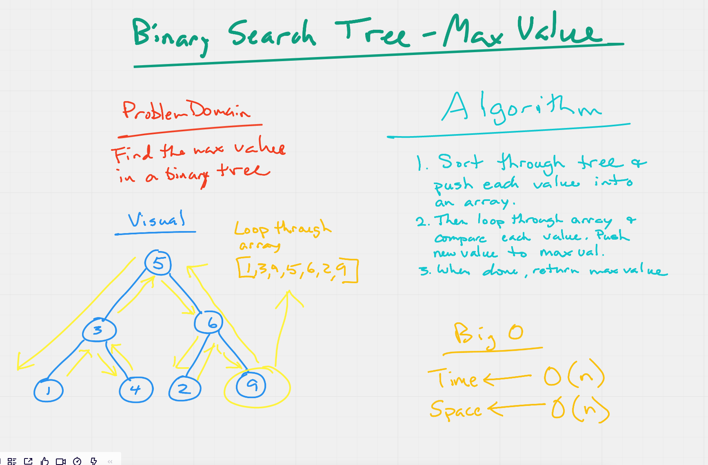
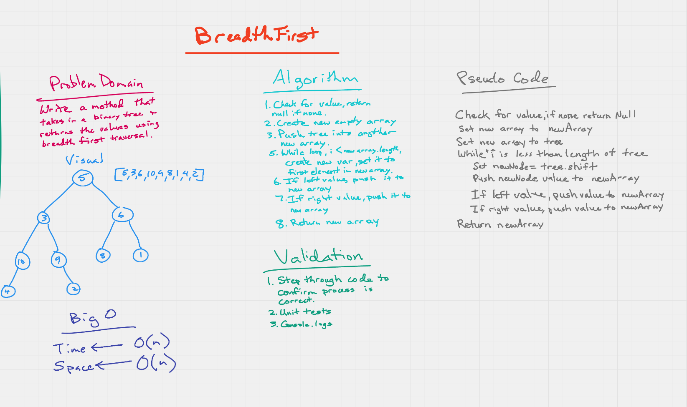

# Trees

- binary search tree challenge

## Challenge

- Write methods to create new binary search trees, search the tree and return the values in the tree based on post order, in order and pre order methodology.
- Write an instance method called find-maximum-value. Without utilizing any of the built-in methods available to your language, return the maximum value stored in the tree. You can assume that the values stored in the Binary Tree will be numeric.
- Write a breadth first traversal method which takes a Binary Tree as its unique input. Without utilizing any of the built-in methods available to your language, traverse the input tree using a Breadth-first approach, and return a list of the values in the tree in the order they were encountered.

## Approach & Efficiency

- I tried to visualize what needed yo happen when adding a new node to the tree and then mapped out the order of the operations as best I could. I eventually needed to review some examples online to get mine to work, but it is working now!

## API

- addNode() - takes in a value and adds a new node to the tree
- contains() - takes in a value and searches the tree. Returns true if found and false if not found.
- preOrder() - sorts the values in the tree base on read, left, right method and return an array of all values in the tree.
- inOrder() - sorts the values in the tree base on  left, read, right method and returns in order an array of all values in the tree.
- postOrder() - sorts the values in the tree base on left, right, read method and return an array of all values in the tree.
- findMaximumValue() - return the maximum value found in the binary tree.
- breadthFirst() - returns the values of the tree starting from the top level to the bottom level

## Testing

1. Can successfully instantiate an empty tree
1. Can successfully instantiate a tree with a single root node
1. Can successfully add a left child and right child to a single root node
1. Can successfully return a collection from a preorder traversal
1. Can successfully return a collection from an inorder traversal
1. Can successfully return a collection from a postorder traversal
1. Can succesfully return the max value in the tree
1. Can successfully return the values of the tree suing breadth first traversal

### UML

